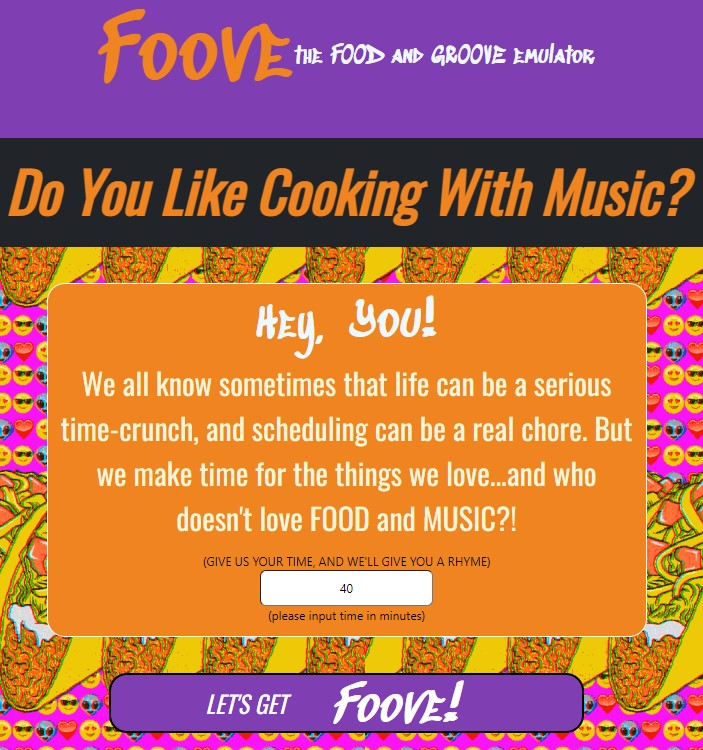
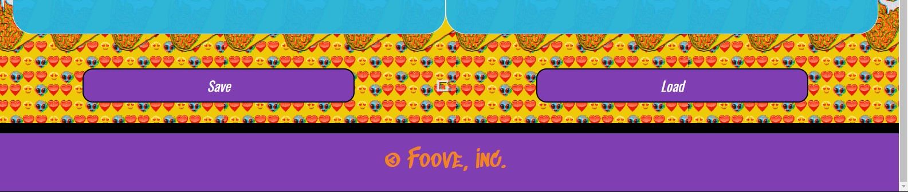

# Foove

## Description

This project makes the daily chore of deciding what to cook a little easier by picking a recipe for its user while simultaneously generating a playlist to promote a fun mood. The project was supposed to feature two APIs: the Spoonacular API for fetching recipes and the Spotify API for curating playlists. The Spotify API is not functioning in the project's current state, so only a recipe will be provided upon user interaction.

## Installation

This project requires no installation whatsoever! Find it on the web here: https://blee241.github.io/Group-Project/.

## Usage

Start by typing the amoung of time in minutes that you would like the spend cooking into the text box. Click the Let's Get Foove! button to generate a recipe.

Scroll down to see the results! 

You can also save up to one recipe by clicking the save button at the bottom of the page. To load the recipe, click the load button on the bottom of the page.

## Credits

Brandon Sebastian: https://github.com/nooburger81.

Bryant Lee: https://github.com/blee241.

Cole Thompson: https://github.com/cm-thom.

Paola Caceres Omana: https://github.com/paolacaceresoma.

The Spoonacular API: https://spoonacular.com/food-api.

The Spotify API: https://develope.r.spotify.com/documentation/web-api.

## License

Copyright 2023 Brandon Sebastian, Bryant Lee, Cole Thompson, Paola Caceres Omana

Permission is hereby granted, free of charge, to any person obtaining a copy of this software and associated documentation files (the “Software”), to deal in the Software without restriction, including without limitation the rights to use, copy, modify, merge, publish, distribute, sublicense, and/or sell copies of the Software, and to permit persons to whom the Software is furnished to do so, subject to the following conditions:

The above copyright notice and this permission notice shall be included in all copies or substantial portions of the Software.

THE SOFTWARE IS PROVIDED “AS IS”, WITHOUT WARRANTY OF ANY KIND, EXPRESS OR IMPLIED, INCLUDING BUT NOT LIMITED TO THE WARRANTIES OF MERCHANTABILITY, FITNESS FOR A PARTICULAR PURPOSE AND NONINFRINGEMENT. IN NO EVENT SHALL THE AUTHORS OR COPYRIGHT HOLDERS BE LIABLE FOR ANY CLAIM, DAMAGES OR OTHER LIABILITY, WHETHER IN AN ACTION OF CONTRACT, TORT OR OTHERWISE, ARISING FROM, OUT OF OR IN CONNECTION WITH THE SOFTWARE OR THE USE OR OTHER DEALINGS IN THE SOFTWARE.